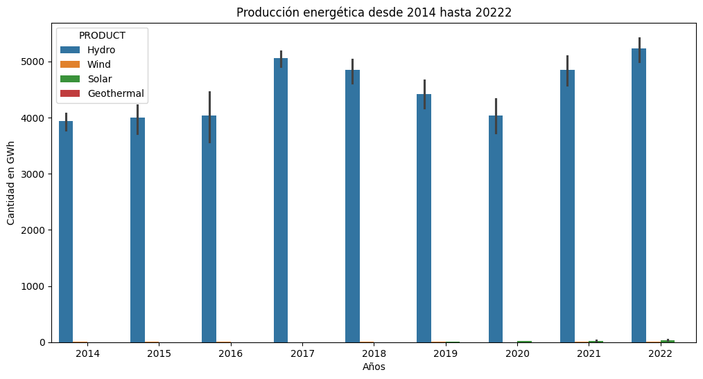
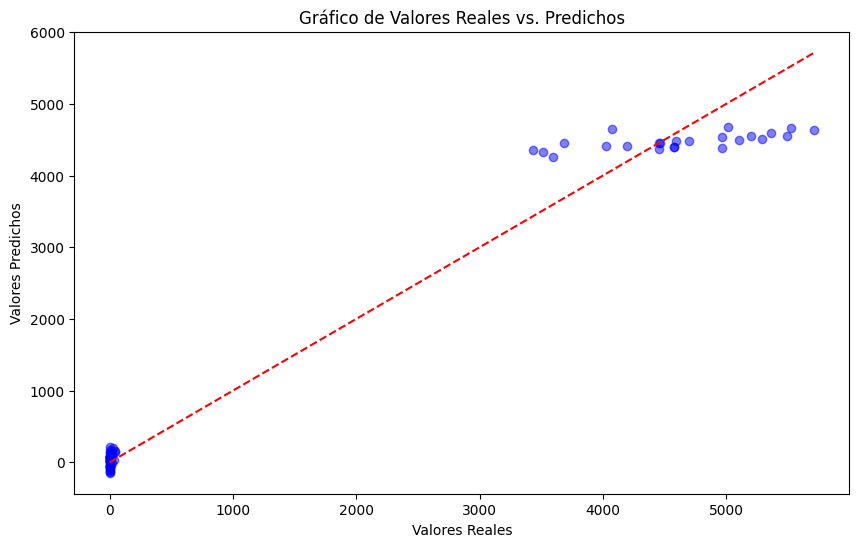
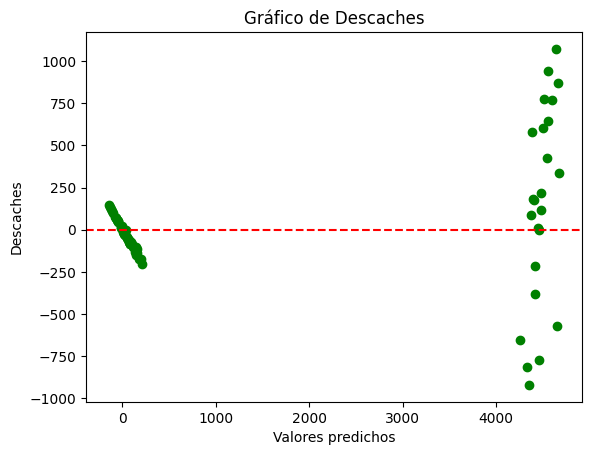

# Predicción de la producción solar, hidroeléctrica, eólica y geotérmica en Colombia.

1. ## Introducción Teórica Sobre el Ciclo de Vida de Proyectos de ML.

El ciclo de vida de un proyecto de Machine Learning (ML) es un proceso iterativo que involucra varias etapas clave:

*	Identificar el problema.
*	Recopilación de datos.
*	Preparación de los datos.
*	Ingeniería de modelos.
*	Evaluación.
*	Despliegue.
*	Mantenimiento y actualización.

2. ## Selección del Contexto y Problema Específico

* ### Contexto 
La transición energética justa se ha convertido en un objetivo clave para garantizar la sostenibilidad y competitividad de los sistemas energéticos en un mundo enfocado en la descarbonización. Sin embargo, la transición global hacia energías más limpias enfrenta desafíos como la intermitencia, que afecta la estabilidad de las redes eléctricas. 
Alcanzar la carbono neutralidad en 2050 requerirá incrementar la generación renovable y optimizar la planificación energética mediante herramientas avanzadas como el aprendizaje automático, que permite prever escenarios futuros con mayor precisión. 

* ### Problema
En el contexto de la actual transición energética justa, se plantea el siguiente problema de estimar la producción energética de fuentes renovables para el corto plazo. Para abordar esta incertidumbre en la producción futura, este proyecto busca desarrollar un modelo de aprendizaje automático (ML) que prediga con precisión la generación de energía solar, eólica, geotérmica e hidroeléctrica en Colombia para el periodo 2025-2030. 

3. ## Análisis Exploratorio de Datos
3.1 Recopilación de los datos:
  * Fuente: El dataset empleado en este modelo procede de los datos históricos sobre la producción mundial de energías renovables y no renovables entre 2010 y 2022, filtrados específicamente para analizar únicamente la información correspondiente a Colombia. Para consultar la fuente de datos original visite: Monthly Electricity Production in GWh ttps://www.kaggle.com/datasets/ccanb23/iea-monthly-electricity-statistic

  * ### Formato: CSV 
### DataFrame: 
El dataset contiene las siguientes características:
* COUNTRY: Nombre del país, para este caso, solo "Colombia"
* CODE_TIME: Código que representa el mes y el año
* TIME: Mes y año en un formato más legible para humanos
* YEAR: Año del dato registrado
* MONTH: Mes del dato registrado como número
* MONTH_NAME: Mes del dato registrado como texto
* PRODUCT: Tipo de producto energético
* VALUE: Cantidad de electricidad generada en gigavatios-hora (GWh)
* DISPLAY ORDER: Orden en el que deben mostrarse los productos
* Year To Date: Cantidad de electricidad generada durante el año actual hasta el mes registrado, en GWh
* Previous Year To Date: Cantidad de electricidad generada durante el año anterior hasta el mes registrado, en GWh
* Share: Porcentaje del producto en la generación total de electricidad del país en formato decimal.

3.2 Recursos:

### Herramientas:
* Python
* Visual Studio Code
* GitHub
* Google Colab

### Librerías:
* Pandas
* Matplotlib
* Numpy
* Seaborn
* Pickle
* Scikit Learn
* Flask

3.3 Tratamiento de Datos Ausentes:
* Imputación: No aplica, ya que se encuentra que solo hay una variable con datos nulos "previousYearToDate", sin embargo, solo son de interés las variables "COUNTRY", "YEAR", "MONTH", PRODUCT" y "VALUE", por lo que no se realizará imputación de datos faltantes y se procede directamente a crear una nueva tabla con los atributos que se requieren.

* Creación de dataframe final: El nuevo dataframe resulta de la eliminación de las variables no relevantes. Así solo se mantienen las variables: COUNTRY, YEAR, MONTH, PRODUCT, VALUE. 

* Adicionalmente, es necesario extraer los samples que en la variable "PRODUCT" incluyen categorías que no son de nuestro interés, de esta forma, solo se mantienen las que se muestran a continuación:

* Hydro: Energía hidroeléctrica
* Wind: Energía eólica
* Solar: Energía solar
* Geothermal: Energía geotérmica

3.4 Análisis Estadístico:

Se realizó un análisis de los valores estadísticos de medida de tendencia central y dispersión de los datos que contiene el dataframe (media, mediana, desviación estándar, etc.). Posteriormente, que muestra la producción energética en GWh de las fuentes hidroeléctrica, eólica, solar y geotérmica en Colombia desde 2014 hasta 2022. Las fuentes eólica, solar y geotérmica tienen una contribución mínima en comparación, con pocos incrementos durante este período. Esta situación resalta la necesidad de diversificar las fuentes de energía, promoviendo las renovables emergentes, para garantizar un sistema energético más equilibrado, sostenible y resiliente ante posibles variaciones climáticas que puedan afectar la producción hidroeléctrica, que es la que genera mayor producción.

3.5 Modelo:

Previo al desarrollo del modelo de Regresión Lineal, se realiza un preprocesamiento de los datos, específicamente en la variable categórica "PRODUCT", que se codifica mediante OneHotEncoder para convertirla en variables numéricas, de esta forma el modelo puede procesarla correctamente. Luego, se construye el modelo de Regresión Lineal usando las variables "YEAR", "MONTH" y las columnas generadas por el OneHotEncoder como variables predictoras, y "VALUE" como la variable objetivo. El conjunto de datos se divide en 80% para entrenamiento y 20% para prueba. 

3.6 Evaluación del modelo:

Después de entrenar el modelo, se evalúa su rendimiento utilizando métricas como el coeficiente R², el error absoluto medio (MAE), el error cuadrático medio (MSE) y la raíz del error cuadrático medio (RMSE) para medir la precisión y la capacidad de predicción del modelo.
Los resultados obtenidos del modelo de Regresión Lineal indican un rendimiento muy alto, pero con algunas consideraciones importantes:
R² (0,9748): Esto significa que el modelo explica el 97.48% de la variabilidad de la variable objetivo ("VALUE"). Es un indicador de que el modelo tiene un ajuste muy bueno a los datos.
MAE (213,15): El error absoluto medio indica que, en promedio, el modelo tiene una desviación de 213.15 unidades en sus predicciones con respecto a los valores reales. Esto puede considerarse un error aceptable.
MSE (121201,10): El error cuadrático medio muestra la media de los errores al cuadrado.
RMSE (348,14): La raíz del error cuadrático medio, indica que en promedio las predicciones del modelo se desvían en 348.14 unidades de los valores reales.

3.7 Despliegue:

Para el despliegue se exporta el modelo entrenado y el encoder correspondiente para su integración con el archivo app.py. A continuación, se crea un entorno de interacción en el archivo index.html, donde se diseña un formulario que permite seleccionar el tipo de energía, el año y el mes para que el usuario ingrese los datos necesarios. 
Posteriormente, el sistema aplica el encoder al campo categórico correspondiente al tipo de fuente de energía, asegurando que el modelo pueda procesar la información correctamente. Con estos datos preprocesados, el modelo genera una predicción, que consiste en un valor en GWh correspondiente al tipo de energía y al periodo seleccionado por el usuario.
Finalmente, el archivo app.py se ejecuta en un servidor para habilitar la funcionalidad completa, que facilite la interacción del usuario con el modelo y asegura la entrega de resultados en un entorno amigable.

3.8 Creación del repositorio en GitHub

Se crea un repositorio en GitHub con el propósito gestionar el proyecto de forma colaborativa y ordenada. En este repositorio se almacenaron todos los archivos clave como: archivo README.md, el código Analisis_ColombiaFinal, app.py, index.html, styles.css, 

# Integrantes

* Andrea Melisa Amaris Dominguez
* Jose Alejandro Garcia Guzman
* Juan Felipe Agudelo Higuita
* Omar Alexander Jaramillo Rivera